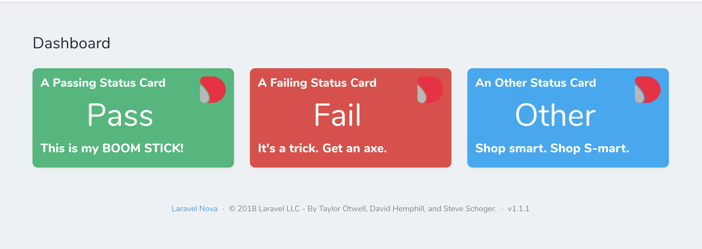

# Nova Package Discovery package

A really simple status card for laravel nova. Configure an endpoint to return a status and a message and you are good to go

 ## Installing the card
 
 
 You can install the card via Composer using the following command
 
 
    composer require devtropolis/statuscard    
 
 
The card needs a url to be passed to it, included in the card package is a test url, you can specify any url you would like

you then need to register the card in the cards array

    public function cards()
    {
        return [
            new Statuscard->options(['/nova-vendor/statuscard/statusTestEndpoint']),
        ];
    }

## Card options

You can customise the following:

 1. Fetch Interval - how often the url is polled in milliseconds  
 2. Card Title - The title displayed at the top  
 3. Icon - an icon to display in the top right of the card

 
 
 to set the options just pass them as a array elements to the options method of the card
     
      (new Statuscard())->options(['title' => 'My Custom Title',
                                             'url' => '/nova-vendor/statuscard/statusTestEndpoint',
                                             'icon' => 'https://avatars3.githubusercontent.com/u/2988541?s=200&v=4'
                                             'fetchInterval' => 5000 
                                             ]),
     

## Endpoint Response Format

In order for the card to display anything you need to configure your endpoint to response with the following object

     return response([
                        'status'=> 'YOUR_RESPONSE_STATUS one of pass,fail,other',
                        'message'=> 'Any message you want displaying in the footer'
     ]);
